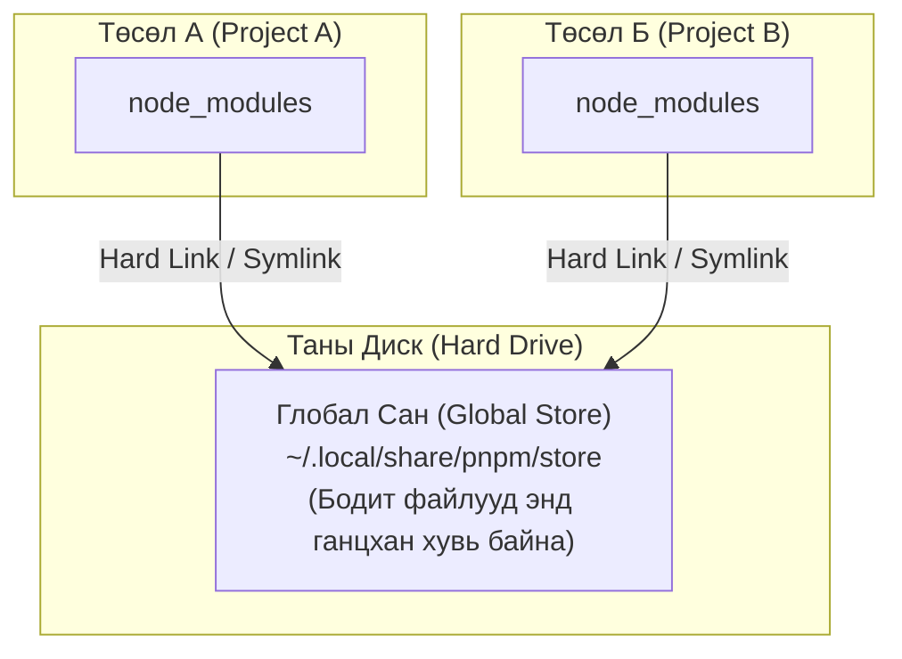

```mermaid

graph TD
    subgraph "Таны Диск (Hard Drive)"
        GlobalStore["Глобал Сан (Global Store)<br>~/.local/share/pnpm/store<br>(Бодит файлууд энд ганцхан хувь байна)"]
    end
    subgraph "Төсөл А (Project A)"
        A_node["node_modules"] -->|Hard Link / Symlink| GlobalStore
    end
    subgraph "Төсөл Б (Project B)"
        B_node["node_modules"] -->|Hard Link / Symlink| GlobalStore
    end

```

sdfsd

